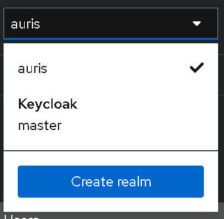
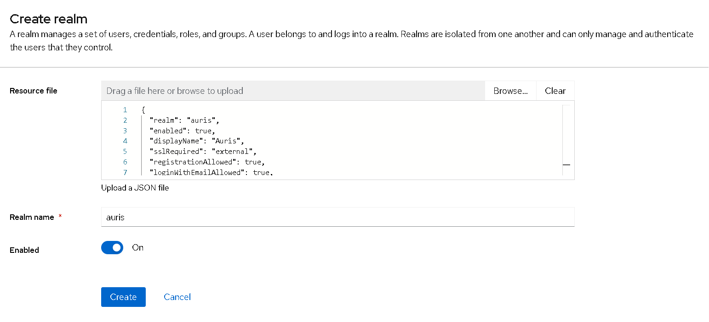
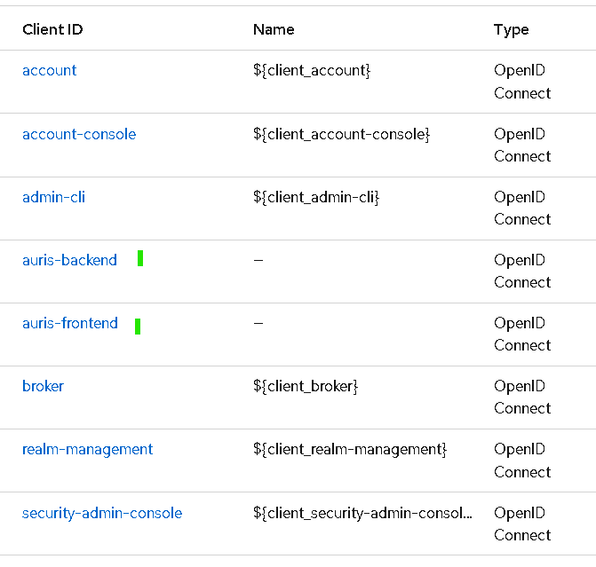
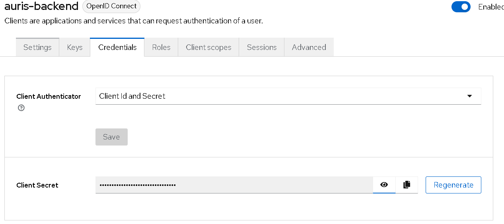
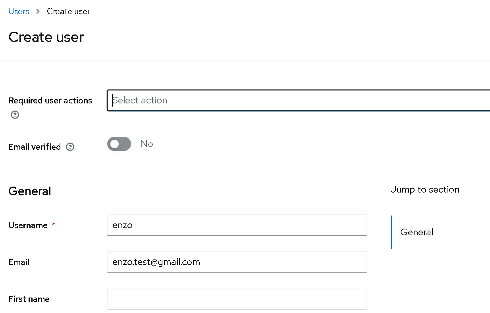
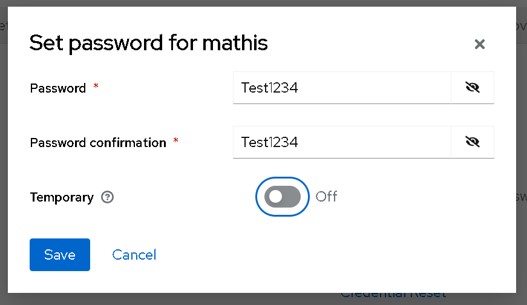

# Auris


Assistant de réunion intelligent — stack européenne souveraine, conforme RGPD.

## Stack technique

| Couche           | Technologie                       |
| ---------------- | --------------------------------- |
| Frontend         | React + TypeScript + Vite         |
| Backend          | FastAPI (Python)                  |
| Base de données | PostgreSQL + SQLAlchemy + Alembic |
| Authentification | Keycloak                          |
| Transcription    | Voxtral Mini V2 (Mistral AI)      |
| Résumé         | Mistral Small 4 (Mistral AI)      |
| Capture audio    | Vexa (auto-hébergé OVH)         |
| Infra            | Docker + Docker Compose           |
| Hébergement     | OVH SecNumCloud                   |

## Prérequis

Tout le projet tourne dans des conteneurs. **Docker et Git suffisent** pour lancer Auris — Python et Node ne sont nécessaires que pour travailler hors conteneur.

### Indispensables

| Outil | Version minimale | Vérification |
| ----- | ---------------- | ------------ |
| Docker Engine | 24.0 | `docker --version` |
| Docker Compose | v2.20 | `docker compose version` |
| Git | 2.30 | `git --version` |

Sous Windows et macOS, **Docker Desktop** fournit les deux premiers d'un coup. Sous Linux, installez Docker Engine puis le greffon `docker-compose-plugin`.

Attention à la syntaxe : ce projet utilise `docker compose` (Compose v2, en deux mots) et non `docker-compose` (v1, obsolète depuis 2023). Les deux ne se comportent pas de la même façon.

### Pour travailler hors conteneur

Nécessaires seulement si vous lancez les tests ou les serveurs de développement directement sur votre machine, sans passer par Docker.

| Outil | Version | Pourquoi cette version |
| ----- | ------- | ---------------------- |
| Python | 3.12 | version de `backend/Dockerfile` et du job `backend` de la CI |
| Node.js | 22 LTS | version de `frontend/Dockerfile` et des jobs `frontend` et `e2e` de la CI |

Ne prenez pas une version supérieure « pour être tranquille » : si vos tests passent en local sur une autre version que celle de la CI, ils peuvent échouer une fois poussés — et l'inverse est encore plus désagréable.

### Ressources machine

- **8 Go de RAM** au minimum. Les quatre conteneurs cohabitent, et Keycloak à lui seul demande environ 1 Go.
- **5 Go d'espace disque** pour les images et le volume PostgreSQL.

## Installation

Comptez une dizaine de minutes au premier lancement, dont l'essentiel en téléchargement d'images.

### 1. Cloner le dépôt

```bash
git clone https://github.com/theochannarond/Auris.git
cd Auris
```

### 2. Créer le fichier d'environnement

**Le fichier va dans `infra/`, pas à la racine du dépôt.** C'est le piège le plus coûteux du projet : Docker Compose cherche son `.env` dans le dossier du fichier de composition, donc un `.env` placé à la racine est purement et simplement ignoré. La pile démarre quand même, avec toutes les variables vides, et échoue plus tard de façon incompréhensible.

```bash
cp .env.example infra/.env          # macOS / Linux
```

```powershell
Copy-Item .env.example infra\.env   # Windows PowerShell
```

Les valeurs d'exemple suffisent pour un premier démarrage. Deux d'entre elles devront être renseignées ensuite : `KEYCLOAK_CLIENT_SECRET` à l'étape 4, et `MISTRAL_API_KEY` le jour où vous voudrez transcrire. Le détail de chaque variable est dans la [section dédiée](#variables-denvironnement).

### 3. Lancer la pile

```bash
docker compose -f infra/docker-compose.yml up
```

Le premier lancement construit les images et télécharge PostgreSQL, Keycloak et Node : **3 à 5 minutes** selon votre connexion. Gardez ce terminal ouvert, les journaux des quatre services s'y affichent. La [sortie attendue](#procédure-docker-compose-up) est documentée plus bas.

**Keycloak met environ une minute de plus que les autres à répondre.** Tant qu'il n'a pas affiché `started in`, `localhost:8080` refuse la connexion — ce n'est pas une panne.

### 4. Importer le realm Keycloak et récupérer le secret client

L'authentification ne fonctionnera pas tant que le realm `auris` n'existe pas. La procédure complète est décrite dans la [section Keycloak](#import-du-realm-keycloak). En résumé : importer `infra/keycloak-realm.json`, copier le secret du client `auris-backend`, le coller dans `infra/.env`, puis relancer le backend :

```bash
docker compose -f infra/docker-compose.yml restart backend
```

### 5. Créer un utilisateur de test

L'export du realm ne contient **aucun utilisateur** — il faut en créer un pour pouvoir se connecter. La marche à suivre est dans la même section Keycloak.

### 6. Vérifier que tout répond

| Service | URL | Attendu |
| ------- | --- | ------- |
| Frontend | http://localhost:5173 | page de connexion Auris |
| API — documentation | http://localhost:8000/docs | interface Swagger |
| API — santé | http://localhost:8000/health | `{"status":"ok",...}` |
| Keycloak | http://localhost:8080 | console d'administration |
| PostgreSQL | `localhost:5432` | accessible via un client SQL |

### Les fois suivantes

```bash
docker compose -f infra/docker-compose.yml up -d       # en arrière-plan
docker compose -f infra/docker-compose.yml logs -f     # suivre les journaux
docker compose -f infra/docker-compose.yml down        # arrêter
```

Les images étant déjà construites et le volume PostgreSQL conservé, le démarrage tombe à une quinzaine de secondes — Keycloak mis à part.

Le code du backend et du frontend est monté depuis votre disque : **vos modifications sont prises en compte sans reconstruire l'image**, uvicorn et Vite rechargent tout seuls. Une reconstruction n'est nécessaire qu'après une modification de `requirements.txt` ou de `package.json` :

```bash
docker compose -f infra/docker-compose.yml up --build
```

## Variables d'environnement

Toute la configuration passe par un seul fichier, **`infra/.env`**, créé à partir de `.env.example`. Il n'est jamais versionné : `.gitignore` exclut `.env` et `.env.*`, à l'exception des modèles `*.example`.

### Ce qui est nécessaire pour démarrer en local

| Variable | Valeur locale | Rôle |
| -------- | ------------- | ---- |
| `POSTGRES_USER` | `auris` | identifiant PostgreSQL, créé au premier démarrage |
| `POSTGRES_PASSWORD` | libre | mot de passe PostgreSQL |
| `KEYCLOAK_ADMIN` | `admin` | compte d'administration de la console Keycloak |
| `KEYCLOAK_ADMIN_PASSWORD` | libre | mot de passe de ce compte |
| `KEYCLOAK_URL` | `http://keycloak:8080` | **nom du service Docker**, pas `localhost` |
| `KEYCLOAK_REALM` | `auris` | doit correspondre au realm importé |
| `KEYCLOAK_CLIENT_ID` | `auris-backend` | client confidentiel utilisé par l'API |
| `KEYCLOAK_CLIENT_SECRET` | *à récupérer* | généré à l'import du realm, voir la section Keycloak |

### Ce qui peut rester vide au début

Ces variables ne bloquent pas le démarrage. Elles ne servent qu'aux fonctionnalités correspondantes, qui échoueront proprement tant qu'elles ne sont pas renseignées.

| Variable | Sans elle |
| -------- | --------- |
| `MISTRAL_API_KEY` | pas de transcription ni de résumé |
| `OVH_ACCESS_KEY`, `OVH_SECRET_KEY`, `OVH_BUCKET_NAME` | l'audio bascule sur le stockage local de repli |
| `VEXA_API_KEY`, `VEXA_WEBHOOK_SECRET` | pas de capture de réunion visio |

### Trois pièges à connaître

**`KEYCLOAK_URL` prend le nom du service Docker, pas `localhost`.** C'est le backend qui appelle cette URL, depuis l'intérieur du réseau Docker, où `localhost` désigne son propre conteneur. `http://localhost:8080` n'est correct que si vous lancez le backend directement sur votre machine.

**`DATABASE_URL` est ignorée par Docker Compose.** Le fichier de composition reconstruit lui-même l'URL à partir de `POSTGRES_USER` et `POSTGRES_PASSWORD`. Modifier `DATABASE_URL` en espérant changer la base à laquelle se connecte le conteneur n'a aucun effet — elle ne sert que si vous lancez le backend hors conteneur, ou pour les migrations Alembic.

**Les variables `VITE_*` ne servent pas en développement local.** Le compose ne les transmet pas au conteneur frontend, qui retombe sur ses valeurs par défaut — lesquelles conviennent en local. Elles ne comptent qu'à la **construction** de l'image de production, où Vite les écrit en dur dans le bundle. Les définir au démarrage d'un conteneur de production n'aurait aucun effet.

### Le second modèle, `backend/.env.example`

Il existe un deuxième fichier d'exemple, destiné à ceux qui lancent le backend **hors conteneur** (`uvicorn` directement sur la machine). Il contient quelques variables absentes du modèle racine — `OVH_ENDPOINT_URL`, `OVH_REGION`, `OVH_BACKUP_BUCKET` — qui ont des valeurs par défaut dans le code et que le compose de développement ne transmet pas.

Pour une installation normale via Docker, **ignorez-le** : seul `infra/.env` est lu.

## Import du realm Keycloak

Un realm Keycloak est un espace d'authentification isolé : ses utilisateurs, ses clients et ses règles. Celui d'Auris est versionné dans `infra/keycloak-realm.json` et doit être importé **une fois** après le premier démarrage.

Sans lui, la connexion échoue avec une page *« We are sorry… Realm does not exist »*.

### 1. Ouvrir la console d'administration

Rendez-vous sur http://localhost:8080 et cliquez sur **Administration console**. Identifiez-vous avec les valeurs `KEYCLOAK_ADMIN` et `KEYCLOAK_ADMIN_PASSWORD` de votre `infra/.env` — par défaut `admin` / `your-admin-password`.

```bash
grep '^KEYCLOAK_ADMIN' infra/.env
```

Ces identifiants n'ont **rien à voir avec ceux de la production**. Le Keycloak local et celui du serveur sont deux instances indépendantes, chacune avec sa propre base et son propre compte d'administration : celui de la production vit dans `/opt/auris/.env.prod` sur le VPS et n'a aucune validité ici.

Ces deux variables ne sont lues qu'au **tout premier** démarrage du conteneur, lorsqu'il crée son compte d'administration. Les modifier ensuite dans `infra/.env` n'a aucun effet.

Si la page ne répond pas, laissez-lui une minute : Keycloak est le plus lent des quatre services à démarrer.

### 2. Créer le realm à partir du fichier

Dépliez le sélecteur de realm, en haut à gauche — il affiche `master` sur une installation neuve — puis cliquez sur **Create realm**.



Sur la page qui s'ouvre, utilisez le champ **Resource file** pour charger `infra/keycloak-realm.json`. Le champ *Realm name* se remplit automatiquement avec `auris` : c'est le signe que le fichier a bien été lu. Cliquez sur **Create**.



### 3. Vérifier les clients importés

Dans le menu de gauche, ouvrez **Clients**. La liste en contient une huitaine : `account`, `admin-cli`, `broker` et les autres sont créés d'office par Keycloak pour son propre fonctionnement. **Les deux qui nous intéressent sont `auris-backend` et `auris-frontend`** — s'ils y sont, l'import a réussi.



| Client | Type | Rôle |
| ------ | ---- | ---- |
| `auris-frontend` | public | utilisé par le navigateur, sans secret — un secret dans du code JavaScript serait lisible par tous |
| `auris-backend` | confidentiel | utilisé par l'API, protégé par un secret |

L'export définit aussi deux rôles, `user` et `admin`.

### 4. Récupérer le secret du client backend

**Le fichier d'export ne contient aucun secret** : Keycloak en génère un neuf à chaque import. Il faut donc aller le chercher.

Ouvrez `auris-backend`, puis l'onglet **Credentials**. Copiez la valeur du champ *Client Secret*.



Collez-la dans `infra/.env` :

```
KEYCLOAK_CLIENT_SECRET=le-secret-copié
```

Puis relancez le backend pour qu'il la prenne en compte :

```bash
docker compose -f infra/docker-compose.yml restart backend
```

### 5. Créer un utilisateur de test

**L'export ne contient aucun utilisateur.** Sans cette étape, vous n'aurez personne avec qui vous connecter.

Menu **Users** → **Add user**. Renseignez le nom d'utilisateur, l'email, **le prénom et le nom**, et activez *Email verified*.



Le prénom et le nom ne sont pas facultatifs en pratique : depuis Keycloak 23, l'action *Verify Profile* est active par défaut et réclame ces champs à la première connexion. Les remplir tout de suite évite un formulaire surprise au milieu de la démonstration.

Une fois l'utilisateur créé, ouvrez son onglet **Credentials** → **Set password**. Saisissez le mot de passe deux fois et, surtout, **basculez *Temporary* sur `Off`** — sinon Keycloak exigera un changement de mot de passe dès la première connexion.



### À savoir

Les URL de redirection du client `auris-frontend` sont limitées à `http://localhost:5173/*`. C'est volontaire : cet export sert au développement local. Un déploiement sur un autre domaine impose d'ajouter l'URL correspondante dans *Clients → auris-frontend → Valid redirect URIs*, faute de quoi Keycloak refusera la redirection après connexion.

Le realm de développement est stocké dans la base H2 interne du conteneur Keycloak. **Un `docker compose down -v` le supprime** et impose de recommencer cet import.

## Procédure `docker compose up`

```bash
docker compose -f infra/docker-compose.yml up
```

La commande se lance **depuis la racine du dépôt**, avec `-f` pour désigner le fichier. Vous pouvez aussi vous placer dans `infra/` et lancer simplement `docker compose up` — mais rappelez-vous alors que les chemins relatifs changent.

Au premier lancement, Docker télécharge PostgreSQL, Keycloak et Node, puis construit les images du backend et du frontend. **3 à 5 minutes** selon la connexion. Les fois suivantes, une quinzaine de secondes.

### Sortie attendue

Les journaux des quatre services s'entremêlent, préfixés par leur nom. Voici les lignes qui comptent, dans l'ordre où elles apparaissent :

```
auris_db        | The files belonging to this database system will be owned by user "postgres".
auris_db        | creating subdirectories ... ok
auris_db        | sh: locale: not found
auris_db        | 2026-08-24 13:25:20.494 UTC [36] WARNING:  no usable system locales were found
...
auris_db        | PostgreSQL init process complete; ready for start up.
auris_db        | 2026-08-24 13:25:23.850 UTC [1] LOG:  database system is ready to accept connections

auris_backend   | INFO:     Will watch for changes in these directories: ['/app']
auris_backend   | INFO:     Uvicorn running on http://0.0.0.0:8000 (Press CTRL+C to quit)
auris_backend   | INFO:     Started reloader process [1] using WatchFiles
auris_backend   | INFO:     Application startup complete.

auris_frontend  |   VITE v8.1.5  ready in 2617 ms
auris_frontend  |   ➜  Local:   http://localhost:5173/
auris_frontend  |   ➜  Network: http://172.22.0.5:5173/

auris_keycloak  | Updating the configuration and installing your custom providers, if any. Please wait.
auris_keycloak  | WARN  [io.qua.dep.ind.IndexWrapper] (build-15) Failed to index jakarta.jms.XAConnection: ...
auris_keycloak  | INFO  [io.qua.dep.QuarkusAugmentor] (main) Quarkus augmentation completed in 40611ms
auris_keycloak  | INFO  [io.quarkus] (main) Keycloak 24.0.x on JVM ... started in 14.4s. Listening on: http://0.0.0.0:8080
```

Les quatre lignes qui signent un démarrage réussi :

| Service | Ligne à attendre |
| ------- | ---------------- |
| `auris_db` | `database system is ready to accept connections` |
| `auris_backend` | `Application startup complete.` |
| `auris_frontend` | `VITE v8.x ready in ...` |
| `auris_keycloak` | `... started in ...` |

### Ce qui ressemble à une erreur et n'en est pas

Trois familles de messages inquiètent systématiquement, à tort :

- **`sh: locale: not found` et `no usable system locales were found`** — l'image PostgreSQL est basée sur Alpine, qui n'embarque pas les locales système. Sans conséquence.
- **Une dizaine de `WARN [io.qua.dep.ind.IndexWrapper] Failed to index ...`** côté Keycloak — Quarkus signale des classes optionnelles absentes (ActiveMQ, Spring, JMS). Bruit de démarrage normal.
- **`Will watch for changes in these directories`** côté backend — c'est le rechargement à chaud d'uvicorn, attendu en développement. En production, cette ligne ne doit pas apparaître.

**Keycloak est de loin le plus lent.** Comptez une minute entre `Please wait.` et `started in` : l'augmentation Quarkus a pris 40 secondes lors de notre test. Pendant tout ce temps, `localhost:8080` refuse la connexion. C'est le faux problème numéro un du projet.

### Vérifier l'état des conteneurs

```bash
docker compose -f infra/docker-compose.yml ps
```

```
NAME             IMAGE                           STATUS          PORTS
auris_backend    infra-backend                   Up 2 minutes    0.0.0.0:8000->8000/tcp
auris_db         postgres:16-alpine              Up 2 minutes    0.0.0.0:5432->5432/tcp
auris_frontend   infra-frontend                  Up 2 minutes    0.0.0.0:5173->5173/tcp
auris_keycloak   quay.io/keycloak/keycloak:24.0  Up 2 minutes    0.0.0.0:8080->8080/tcp
```

Les quatre doivent être `Up`. `auris_db` affiche en plus `(healthy)` : c'est le seul à déclarer une sonde en développement.

### Arrêter

```bash
docker compose -f infra/docker-compose.yml down     # arrête et supprime les conteneurs
docker compose -f infra/docker-compose.yml down -v  # supprime AUSSI les volumes
```

**`down -v` efface la base PostgreSQL et le realm Keycloak.** Il faudra tout réimporter et recréer l'utilisateur de test. À n'utiliser que pour repartir volontairement de zéro.

## Dépannage

Les cinq problèmes que l'équipe a réellement rencontrés, avec le message d'erreur exact pour pouvoir le retrouver par recherche.

Avant tout, le réflexe utile : isoler les journaux d'**un seul** service plutôt que de lire les quatre mélangés.

```bash
docker compose -f infra/docker-compose.yml logs backend
docker compose -f infra/docker-compose.yml logs -f keycloak   # en continu
```

### 1. Le moteur Docker n'est pas démarré

```
error during connect: Get "http://%2F%2F.%2Fpipe%2FdockerDesktopLinuxEngine/v1.47/images/...":
open //./pipe/dockerDesktopLinuxEngine: The system cannot find the file specified.
```

Sous Linux, le même problème s'annonce ainsi :

```
Cannot connect to the Docker daemon at unix:///var/run/docker.sock. Is the docker daemon running?
```

**Cause** : Docker Desktop n'est pas lancé, ou n'a pas fini de démarrer.

**Solution** : lancez Docker Desktop et attendez que l'icône cesse de s'animer — elle doit indiquer *Engine running*. Comptez une trentaine de secondes. Sous Linux : `sudo systemctl start docker`.

### 2. Un port est déjà occupé

```
Error response from daemon: Ports are not available: exposing port TCP 0.0.0.0:5432 ->
0.0.0.0:0: listen tcp 0.0.0.0:5432: bind: address already in use
```

**Cause** : un autre programme occupe déjà le port. Le cas le plus fréquent est un PostgreSQL installé directement sur la machine, qui monopolise le 5432. Les ports utilisés par le projet sont **5432**, **8000**, **8080** et **5173**.

**Identifier le coupable** :

```powershell
netstat -ano | findstr :5432        # Windows — la dernière colonne est le PID
```

```bash
lsof -i :5432                       # macOS / Linux
```

**Solution** : arrêter le programme en question, ou modifier le port publié dans `infra/docker-compose.yml` — par exemple `"5433:5432"`, qui déplace le port côté machine sans rien changer à l'intérieur du réseau Docker.

### 3. Le fichier `.env` n'est pas au bon endroit

```
WARN[0000] The "POSTGRES_USER" variable is not set. Defaulting to a blank string.
WARN[0000] The "POSTGRES_PASSWORD" variable is not set. Defaulting to a blank string.
```

suivi, un peu plus loin, de :

```
auris_db | Error: Database is uninitialized and superuser password is not specified.
```

**Cause** : le `.env` a été placé à la racine du dépôt. Docker Compose lit son `.env` dans le dossier du fichier de composition, donc `infra/.env` — celui de la racine est purement ignoré.

**Solution** :

```bash
cp .env.example infra/.env
```

**Vérifier** que les variables sont bien résolues, sans lancer quoi que ce soit :

```bash
docker compose -f infra/docker-compose.yml config
```

Aucun avertissement `variable is not set` ne doit apparaître.

### 4. Keycloak ne répond pas, ou le realm est introuvable

`localhost:8080` renvoie `ERR_CONNECTION_REFUSED` alors que le conteneur est `Up`.

**Cause** : Keycloak n'a pas fini de démarrer. Il lui faut environ une minute, dont 40 secondes d'augmentation Quarkus.

**Solution** : attendre la ligne `started in` dans `docker compose -f infra/docker-compose.yml logs keycloak`. Ne relancez pas la pile, vous ne feriez que repartir de zéro.

Si la console s'affiche mais que la connexion à l'application échoue avec :

```
We are sorry... Realm does not exist
```

**Cause** : le realm `auris` n'a jamais été importé, ou il a été effacé par un `down -v`.

**Solution** : refaire l'[import du realm](#import-du-realm-keycloak).

### 5. Toutes les routes de l'API renvoient 401

Vous êtes connecté, mais chaque appel échoue et le dashboard reste vide.

**Cause la plus fréquente** : `KEYCLOAK_CLIENT_SECRET` est resté à sa valeur d'exemple, ou le backend n'a pas été relancé après l'avoir renseigné. Le secret est généré à l'import du realm et n'existe donc pas avant.

**Vérifier ce que voit réellement le conteneur** :

```bash
docker compose -f infra/docker-compose.yml exec backend env | grep KEYCLOAK
```

**Solution** : copier le secret depuis *Clients → auris-backend → Credentials*, le coller dans `infra/.env`, puis :

```bash
docker compose -f infra/docker-compose.yml restart backend
```

**Autre cause possible** : votre session a expiré. Les jetons Keycloak durent quelques minutes ; l'application les renouvelle automatiquement, mais si le renouvellement échoue vous êtes renvoyé vers la page de connexion.

### Après un `git pull` : le frontend ne répond plus

`localhost:5173` renvoie `ERR_CONNECTION_REFUSED` alors que `auris_frontend` est bien `Up`.

**Cause** : `docker compose up` ne reconstruit pas une image qui existe déjà. Si le `Dockerfile` a changé depuis votre dernier build, vous faites tourner l'ancienne.

**Solution** :

```bash
docker compose -f infra/docker-compose.yml up --build
```

Même réflexe après toute modification de `requirements.txt` ou de `package.json`.

## Structure du projet


auris/

├── frontend/             # React + TypeScript + Vite

│   └── src/

│       ├── assets/       # Images, icônes, fonts

│       ├── components/   # Composants réutilisables

│       ├── pages/        # Une page = une route

│       ├── services/     # Appels API vers le backend

│       ├── hooks/        # Custom React hooks

│       ├── store/        # État global

│       ├── types/        # Interfaces TypeScript

│       └── utils/        # Fonctions utilitaires

├── backend/              # FastAPI + Python

│   ├── app/

│   │   ├── api/v1/       # Endpoints REST

│   │   ├── core/         # Configuration centrale

│   │   ├── models/       # SQLAlchemy (tables)

│   │   ├── schemas/      # Pydantic (API I/O)

│   │   └── services/     # Logique métier

│   └── tests/

├── infra/                # Docker Compose

└── docs/                 # Documentation technique


## Gouvernance

- **Branches** : `type/SCRUM-USXX-description`
- **Commits** : `type(scope) : description [SCRUM-XX]`
- **Tickets** : Jira — projet Auris
